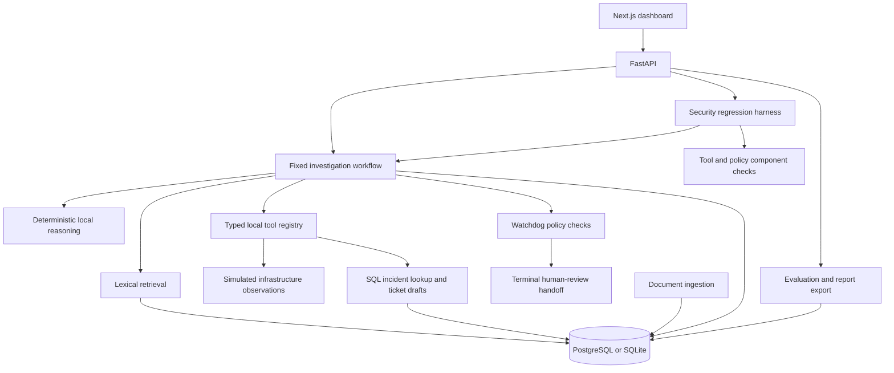

# OpsGuard AI

OpsGuard AI coordinates evidence retrieval, typed operational tools, safety-policy checks, and human-review handoffs for incident triage.

## Overview

Incident triage requires assembling observations from alerts, logs, runbooks, and previous incidents while distinguishing facts from assumptions. OpsGuard records that investigation as a sequence of steps, with retrieved source references, tool results, uncertainty, and policy findings available for review.

A FastAPI service runs the investigation through a closed tool registry and a fixed reasoning workflow. A Next.js dashboard presents the recorded activity. Deterministic security scenarios exercise individual controls and the agent workflow, and evaluation endpoints export the resulting indicators.

## Key Capabilities

- Document ingestion, section-aware character chunking, and deterministic lexical retrieval over SQL data.
- Run-scoped evidence snapshots with source, document, chunk, and tool-call identifiers, timestamps, trust labels, and screening findings.
- Seven executable local tools for observations, runbook retrieval, incident lookup, and internal ticket drafting.
- Persisted investigation steps, every tool invocation attempt (including denials), assessments, and typed watchdog findings.
- Nine security regression scenarios covering retrieved content, tool output, unsafe actions, and review requirements.
- Dashboard inspection and stored Markdown/JSON reports with explicit execution cohorts, versions, provenance, and metric denominators.

## Architecture



The backend uses FastAPI, SQLModel, and Pydantic; the frontend uses Next.js, React, TypeScript, and Tailwind CSS. See the [architecture reference](docs/ARCHITECTURE.md), [agent execution flow](docs/AGENT_GRAPH.md), and [data model](docs/DATA_MODEL.md).

## Safety Model

External context is data, not authority to change the workflow or tool registry. Documents and tool observations carry trust labels; retrieved chunks and tool outputs are screened for known injection indicators.

Public ingestion cannot assign trusted authority. Retrieval applies the most restrictive document, chunk, and metadata trust label, excludes quarantined content, and requires lexical relevance. Failed and blocked tool attempts remain audit records rather than supporting evidence. Historical views show only the evidence recorded during that run.

The closed registry validates tool inputs and outputs. Five destructive action definitions return blocked responses: canceling jobs, draining or isolating nodes, blocking users, and disabling services. Watchdog policies inspect typed action intent and parameters first, keeping evidence separate from proposals. They validate same-run references to valid observations and supplement those checks with normalized proposal-text and suspicious-content screening. Recommendations remain candidates until policy review; local tickets record pending-review or blocked lifecycle after that decision.

Every successful investigation ends in a human-review state. This is a terminal handoff, not an approve/reject/resume execution mechanism. See the [safety boundaries and enforcement limits](docs/SECURITY_BOUNDARIES.md).

## Evaluation

The harness provides nine deterministic security regression checks: one full agent workflow, two component cases, five policy cases, and one tool-boundary case. Each result records its test level, explicit expectations, and mandatory-invariant outcomes. New executions use strict pass/fail; a destructive handler invocation forces failure.

Evaluation selects one completed executed harness cohort and snapshots its scenario/provider/policy versions, related run IDs, result observations, and metrics. Every rate exposes numerator and denominator, with `null` for an unavailable rate. Reports cover application invariant preservation, structural evidence integrity, and terminal human review; they do not establish semantic correctness, calibrated confidence, or general prompt-injection resistance. There is no overall AI safety score.

Seeding creates clearly labeled fixture history, which cannot satisfy an execution requirement. Evaluate the returned `harness_run_id` and retain the `evaluation_run_id` for matching JSON/Markdown exports. Stored reports do not change when unrelated agent activity occurs. See [scenario coverage](docs/SECURITY_HARNESS.md) and [metric formulas and limitations](docs/EVALUATION.md).

## Quick Start

Use Python 3.11 and Node 22. From the repository root:

```bash
python3.11 -m venv .venv
source .venv/bin/activate
python -m pip install --require-hashes -r backend/requirements-dev.txt
export PYTHONPATH=backend
export DATABASE_URL=sqlite:///./opsguard.db
python -m app.db.init_db
python -m uvicorn app.main:app --host 127.0.0.1 --port 8000
```

In another terminal, run `cd frontend`, `npm ci`, then `npm run dev`. Open `http://localhost:3000`. Use `bash scripts/demo_walkthrough.sh` from the root for the complete local reproduction.

See [Setup](docs/SETUP.md) for configuration, Compose, readiness and dependency maintenance. The stack uses PostgreSQL, an explicit schema initializer, backend and frontend; no unused integration services run.

## Example Workflow

1. Open the dashboard and run the GPU investigation.
2. Inspect the recorded retrieval context and tool outputs alongside the hypotheses and assessment in the step trace.
3. Review the recommendation, missing evidence, and watchdog findings. The run ends awaiting human review.
4. Run the security harness, then generate an evaluation and open its Markdown or JSON report.

Use a disposable local database for harness work. The [API walkthrough](docs/DEMO_SCRIPT.md) provides fixture identifiers, explicit requests, and reset caveats.

## API

The service groups endpoints under `/api/v1` for health/setup, documents, retrieval, tools, agent runs, watchdog checks, harness results, and evaluation exports.

Use the running service's [OpenAPI schema](http://localhost:8000/openapi.json) as the API contract and the [API reference](docs/API_SPEC.md) for request examples. FastAPI also serves [Swagger UI](http://localhost:8000/docs); the current security headers can prevent its external assets from loading.

## Development

[CONTRIBUTING.md](CONTRIBUTING.md) lists the same checks used by [CI](.github/workflows/ci.yml): backend pytest/Ruff/scoped mypy, frontend tests/lint/type checking/build, dependency audits, Markdown links and container builds. CI uses Python 3.11 and Node 22.

Report vulnerabilities using [SECURITY.md](SECURITY.md). A repository license has not yet been selected.

## Security and Limitations

OpsGuard currently uses deterministic local reasoning for reproducible development and security regression testing. Infrastructure adapters return deterministic local observations and do not execute live Slurm, Docker, network, or system operations. The registry is an internal Python API, not an MCP server.

Human review is currently a terminal workflow state; authenticated approval and post-approval execution are not implemented. The API has no authentication and is intended for local use. Compose binds published ports to loopback and runs no unused Qdrant service; external model providers are not implemented.

Trust labels do not authenticate sources, and valid evidence references do not establish semantic support for a claim. Audit persistence requires a working database; crashes may leave incomplete invocation checkpoints. Audit rows are not tamper-evident, and fixture resets require care. Pattern screening is limited, and assessment values are uncalibrated. Consult the [security boundaries](docs/SECURITY_BOUNDARIES.md), [retrieval reference](docs/RAG_DESIGN.md), and [evaluation limitations](docs/EVALUATION.md) before extending the system.

## Roadmap

- Reviewed trust promotion, source authentication, and claim-level support checks.
- Broader independently labeled evaluation cases and isolated benchmark environments.
- Recovery of interrupted executions and broader database migration support.
- An injected reasoning-provider interface that preserves deterministic testing.
- Authenticated review workflows and bounded external integrations.
