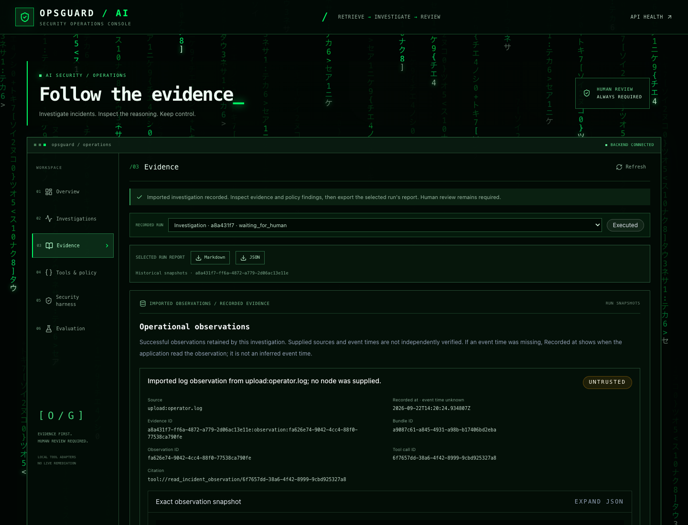
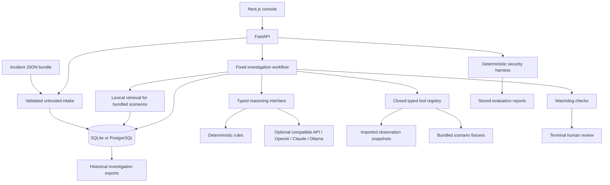

# OpsGuard AI

Evidence-based incident triage with typed tools, safety-policy checks, and a recorded handoff to human review.

## Overview

An alert rarely contains enough information to explain an incident. Operators need to assemble logs, metrics, workload details, and source timestamps, identify what is missing, and assess a proposed response before acting.

OpsGuard turns that investigation into an inspectable record. Upload a log, CSV, JSONL, Markdown, text, or JSON export, review its automatically converted incident bundle, run a bounded reasoning workflow, inspect its evidence and policy findings, and export the investigation. The application preserves the observations used during each run, including their source identity and trust status.

It serves two related engineering tasks: **AI-assisted infrastructure triage** and **security regression testing of the AI application's own controls**. It does not replace your monitoring system or operate your cluster. Grafana, Prometheus, Slurm, and other systems can supply observations through the documented bundle format; live connectors are not included.



The screenshot shows a synthetic log export after local conversion and a deterministic investigation.

## Key Capabilities

- Convert common text-based incident exports to JSON in the browser, with a review and download step before import.
- Import alerts and log, metric, job, and network observations without connecting to live infrastructure. Missing event times and targets remain explicit gaps.
- Investigate imported data in isolation from bundled scenario fixtures and the global document catalog.
- Run deterministic reasoning offline, or select an OpenAI-compatible endpoint, OpenAI, Claude, or Ollama through backend configuration.
- Preserve evidence identity, original observation time, content, trust, gaps, and provider provenance in each run.
- Validate structured model output, restrict tool execution, and record watchdog findings before human review.
- Export individual investigations and deterministic security evaluations as JSON or Markdown.
- Explore traces, evidence, tool attempts, and regression results in a terminal-style dashboard.

## Architecture



The fixed workflow makes four bounded reasoning calls when a model provider is selected. Models propose classifications, hypotheses, assessments, and recommendations; application code owns evidence, tool selection, policy, and persistence. Imported investigations read their own saved observations and do not retrieve scenario fixtures. See [Architecture](docs/ARCHITECTURE.md) and [Agent Workflow](docs/AGENT_GRAPH.md).

## Safety Model

Imported observations, retrieved documents, and model output are untrusted. Public intake cannot grant trusted authority. Lexical retrieval requires relevance, resolves conflicting trust restrictively, and excludes quarantined content.

The registry separates executable local adapters from destructive definitions that have no handlers. Invalid, denied, or failed calls cannot become supporting evidence. Typed output validation rejects malformed proposals and evidence references outside the run; watchdog policies inspect action intent, grounding identities, suspicious content, and review requirements.

A successful investigation ends at human review. No approve/reject/resume execution mechanism is implemented. Reports preserve historical observations rather than retrieving new context when an old run is opened. See [Security Boundaries](docs/SECURITY_BOUNDARIES.md).

## Quick Start

Use **Python 3.11** and **Node 22**. Commands below assume a checkout of this repository and start a local SQLite instance without model credentials.

**1. Install and start the backend**, from the repository root:

```bash
python3.11 -m venv .venv
source .venv/bin/activate
python -m pip install --require-hashes -r backend/requirements-dev.txt
export PYTHONPATH=backend
export DATABASE_URL=sqlite:///./opsguard.db
export LLM_PROVIDER=deterministic
python -m app.db.init_db &&
python -m uvicorn app.main:app --host 127.0.0.1 --port 8000
```

**2. Start the frontend** in another terminal, from the repository root:

```bash
cd frontend
node --version  # should report v22.x
npm ci
npm run dev
```

**3. Open [localhost:3000](http://localhost:3000)** on the same computer. Use this address rather than a LAN IP so the default browser-origin configuration matches. The Overview should show a connected backend and deterministic reasoning.

**4. Open Investigations**, choose a supported file (or [normal-workload.json](examples/incidents/normal-workload.json)), review the conversion, then complete the clearly labeled **Save evidence** and **Run investigation** steps. Inspect the saved evidence, review the findings, then download its Markdown or JSON report. No seeding or API key is needed for this path.

For Compose, supported configuration, and troubleshooting, see [Setup](docs/SETUP.md). For a complete manual test checklist, see [Run and Test](docs/RUN_AND_TEST.md).

## Example Workflow

Suppose a GPU alert reports sustained utilization. Export a small set of related observations from your monitoring and scheduler systems. OpsGuard converts supported files into an [incident bundle](docs/INCIDENT_BUNDLES.md) automatically; a canonical bundle can also retain typed metrics, jobs, and network records.

1. Select the file and review the converted JSON. Import the alert with its observations. OpsGuard assigns bundle and observation identities and treats the content as untrusted.
2. Start an investigation with the selected reasoning provider. With a remote provider, the bounded alert/evidence context is sent to that service.
3. Inspect the hypotheses beside their evidence, missing information, tool attempts, and watchdog result. High utilization alone is not proof of abuse.
4. Export the record and use it in your existing incident process. An operator decides what to do outside OpsGuard.

Four [example bundles](examples/incidents) cover a normal workload, suspicious activity, insufficient evidence, and malicious instructions embedded in a log. They are synthetic inputs, not evidence of measured customer outcomes.

## Model Providers

Deterministic reasoning is the default. Select one backend provider and restart the backend to change it:

| Provider | `LLM_PROVIDER` | Required settings |
| --- | --- | --- |
| Local rules | `deterministic` | None |
| OpenAI-compatible Chat Completions | `institutional` | `INSTITUTIONAL_LLM_BASE_URL`, `INSTITUTIONAL_LLM_API_KEY`, `INSTITUTIONAL_LLM_MODEL` |
| OpenAI Responses | `openai` | `OPENAI_API_KEY`, `OPENAI_MODEL` |
| Claude | `anthropic` | `ANTHROPIC_API_KEY`, `ANTHROPIC_MODEL` |
| Ollama | `ollama` | `OLLAMA_MODEL`; local endpoint configured by `OLLAMA_BASE_URL` |

Keep credentials only in the backend environment or ignored root `.env`, never `.env.example` or `NEXT_PUBLIC_*`. A configured provider is not proof of a successful request. Provider errors fail explicitly; the system does not silently switch providers.

See [Provider Setup](docs/PROVIDERS.md) for generic compatible-endpoint configuration, local Ollama setup, timeouts, and data-handling boundaries.

## Evaluation

The security harness runs nine **deterministic regression scenarios**: one full agent workflow, two component cases, five policy cases, and one tool-boundary case. Each records explicit expectations and mandatory-invariant outcomes. Fixture history is labeled separately and cannot count as an executed result.

Evaluation snapshots one executed cohort with its versions, observations, numerator, and denominator for each metric. These checks establish specific application behaviors; confidence and coverage indicators do not establish semantic correctness, calibrated safety, or general prompt-injection resistance. The suite does not benchmark the live model providers.

On a disposable local database, execute the Security harness workspace, then generate and export its Evaluation report. The command-line equivalent is:

```bash
bash scripts/demo_walkthrough.sh
```

The script checks that the backend uses deterministic reasoning **before** creating records. See [Security Harness](docs/SECURITY_HARNESS.md) and [Evaluation](docs/EVALUATION.md).

## API

Endpoints under `/api/v1` cover health, incident intake, investigation history and exports, documents/retrieval, tools, watchdog policies, the security harness, and evaluation.

Use the [OpenAPI schema](http://localhost:8000/openapi.json) and [API Reference](docs/API_SPEC.md). [Swagger UI](http://localhost:8000/docs) is also served; current response security headers may prevent its external assets from loading.

## Development

From the repository root with the Python environment active:

```bash
export LLM_PROVIDER=deterministic
export DATABASE_URL=sqlite://
python -m pytest backend/tests -q &&
python -m ruff check backend scripts &&
python -m mypy &&
python scripts/check_secrets.py &&
python scripts/check_markdown_links.py &&
git diff --check
```

Then, from `frontend/`:

```bash
npm test && npm run lint && npm run typecheck && npm run build
```

Stop the development server before building into its `.next` directory. Tests simulate provider responses and do not require model keys. [CONTRIBUTING.md](CONTRIBUTING.md) describes CI, dependency maintenance, container checks, and the optional staged-file credential guard.

## Security and Limitations

The API has no authentication or tenant isolation. Keep it local; this is not a hosted SaaS deployment. Report security issues according to [SECURITY.md](SECURITY.md).

Infrastructure adapters read imported observations or deterministic fixtures. They do not execute live Slurm, Docker, network, or system operations. The tool registry is an internal Python interface, not an MCP server. Human review remains a terminal workflow state.

Trust labels do not authenticate a source, and valid citation IDs do not prove that a claim follows from the evidence. Pattern screening is incomplete. Audit records are ordinary SQL data, not tamper-evident storage. Provider responses and self-assessed confidence require operator judgment. A local Ollama endpoint avoids a hosted model service only when the selected model itself executes locally; verify your model and endpoint configuration.

## Roadmap

- Read-only monitoring and scheduler connectors with explicit source and access boundaries.
- Reviewed trust promotion and claim-level support checks.
- Independently labeled provider evaluations with explicit data and cost controls.
- Recovery for interrupted runs and broader database migrations.
- Authenticated review workflows before multi-user deployment.
