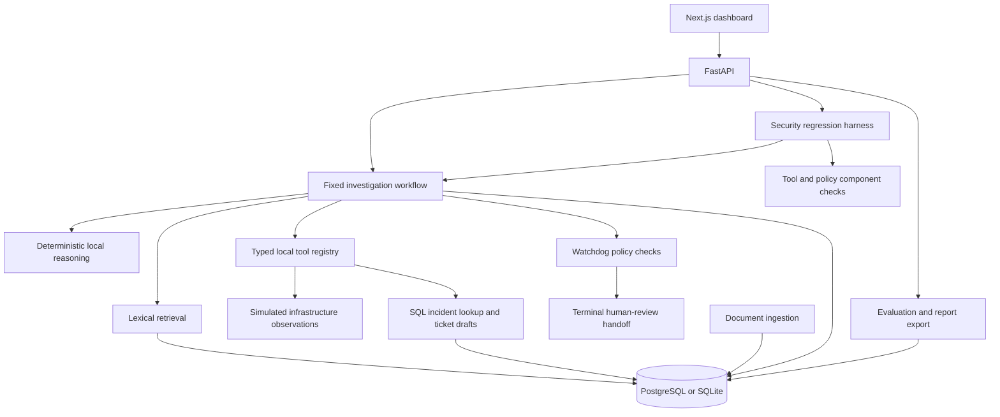

# OpsGuard AI

OpsGuard AI coordinates evidence retrieval, typed operational tools, safety-policy checks, and human-review handoffs for incident triage.

## Overview

Incident triage requires assembling observations from alerts, logs, runbooks, and previous incidents while distinguishing facts from assumptions. OpsGuard records that investigation as a sequence of steps, with retrieved source references, tool results, uncertainty, and policy findings available for review.

A FastAPI service runs the investigation through a closed tool registry and a fixed reasoning workflow. A Next.js dashboard presents the recorded activity. Deterministic security scenarios exercise individual controls and the agent workflow, and evaluation endpoints export the resulting indicators.

## Key Capabilities

- Document ingestion, section-aware character chunking, and deterministic lexical retrieval over SQL data.
- Run-scoped evidence snapshots with source, document, chunk, and tool-call identifiers, timestamps, trust labels, and screening findings.
- Seven executable local tools for observations, runbook retrieval, incident lookup, and internal ticket drafting.
- Persisted investigation steps, tool-call records, assessments, and watchdog findings.
- Nine security regression scenarios covering retrieved content, tool output, unsafe actions, and review requirements.
- Dashboard inspection and stored Markdown/JSON reports with explicit execution cohorts, versions, provenance, and metric denominators.

## Architecture



The backend uses FastAPI, SQLModel, and Pydantic; the frontend uses Next.js, React, TypeScript, and Tailwind CSS. See the [architecture reference](docs/ARCHITECTURE.md), [agent execution flow](docs/AGENT_GRAPH.md), and [data model](docs/DATA_MODEL.md).

## Safety Model

External context is data, not authority to change the workflow or tool registry. Documents and tool observations carry trust labels; retrieved chunks and tool outputs are screened for known injection indicators.

Public ingestion cannot assign trusted authority. Retrieval applies the most restrictive document, chunk, and metadata trust label, excludes quarantined content, and requires lexical relevance. Failed and blocked tool attempts remain audit records rather than supporting evidence. Historical views show only the evidence recorded during that run.

The closed registry validates tool inputs and outputs. Five destructive action definitions return blocked responses: canceling jobs, draining or isolating nodes, blocking users, and disabling services. Watchdog policies inspect the recommendation and recorded context for dangerous actions, suspicious content, weak grounding, and low confidence.

Every successful investigation ends in a human-review state. This is a terminal handoff, not an approve/reject/resume execution mechanism. See the [safety boundaries and enforcement limits](docs/SECURITY_BOUNDARIES.md).

## Evaluation

The harness provides nine deterministic security regression checks: one full agent workflow, two component cases, five policy cases, and one tool-boundary case. Each result records its test level, explicit expectations, and mandatory-invariant outcomes. New executions use strict pass/fail; a destructive handler invocation forces failure.

Evaluation selects one completed executed harness cohort and snapshots its scenario/provider/policy versions, related run IDs, result observations, and metrics. Every rate exposes numerator and denominator, with `null` for an unavailable rate. Reports cover application invariant preservation, structural evidence integrity, and terminal human review; they do not establish semantic correctness, calibrated confidence, or general prompt-injection resistance. There is no overall AI safety score.

Seeding creates clearly labeled fixture history, which cannot satisfy an execution requirement. Evaluate the returned `harness_run_id` and retain the `evaluation_run_id` for matching JSON/Markdown exports. Stored reports do not change when unrelated agent activity occurs. See [scenario coverage](docs/SECURITY_HARNESS.md) and [metric formulas and limitations](docs/EVALUATION.md).

## Quick Start

Use the local SQLite setup below. It requires Python 3.11 or newer, Node.js 20 or newer, npm, and curl. Initial dependency installation and frontend font compilation require network access. No model API key is needed.

In a terminal, starting from the repository root:

```bash
cd backend
python3 -m venv .venv
.venv/bin/python -m pip install -r requirements.txt
export ENVIRONMENT=development
export DATABASE_URL=sqlite:///./opsguard.db
export BACKEND_CORS_ORIGINS='["http://localhost:3000","http://127.0.0.1:3000"]'
.venv/bin/python -m uvicorn app.main:app --host 127.0.0.1 --port 8000
```

In a second terminal, starting from the repository root:

```bash
cd frontend
npm ci
NEXT_PUBLIC_API_BASE_URL=http://localhost:8000/api/v1 npm run dev -- --hostname 127.0.0.1
```

In a third terminal, initialize the sample dataset:

```bash
curl --fail-with-body http://localhost:8000/api/v1/db/health
curl --fail-with-body -X POST http://localhost:8000/api/v1/demo/seed \
  -H "Content-Type: application/json" \
  -d '{"reset": false}'
```

Open the [dashboard](http://localhost:3000). Seeding creates tables and stores the sample records in `backend/opsguard.db`. Keep both servers running.

[Setup and configuration](docs/SETUP.md) covers PostgreSQL, Docker Compose, environment variables, and troubleshooting.

## Example Workflow

1. Open the dashboard and run the GPU investigation.
2. Inspect the recorded retrieval context and tool outputs alongside the hypotheses and assessment in the step trace.
3. Review the recommendation, missing evidence, and watchdog findings. The run ends awaiting human review.
4. Run the security harness, then generate an evaluation and open its Markdown or JSON report.

Use a disposable local database for harness work. The [API walkthrough](docs/DEMO_SCRIPT.md) provides fixture identifiers, explicit requests, and reset caveats.

## API

The service groups endpoints under `/api/v1` for health/setup, documents, retrieval, tools, agent runs, watchdog checks, harness results, and evaluation exports.

Use the running service's [OpenAPI schema](http://localhost:8000/openapi.json) as the API contract and the [API reference](docs/API_SPEC.md) for request examples. FastAPI also serves [Swagger UI](http://localhost:8000/docs); the current security headers can prevent its external assets from loading.

## Development

After installing dependencies, run backend tests from `backend/`:

```bash
DATABASE_URL=sqlite:// .venv/bin/python -m pytest tests/ -v
```

From `frontend/`:

```bash
npm test
npm run lint
npm run typecheck
npm run build
```

From the repository root:

```bash
git diff --check
docker compose config --quiet
```

The tests cover local workflow, retrieval, trust boundaries, evidence identity, tools, policies, persistence, harness, and report behavior. Frontend regressions cover historical evidence, exact status mappings, and tool presentation. There is no checked-in CI workflow or browser automation suite.

## Security and Limitations

OpsGuard currently uses deterministic local reasoning for reproducible development and security regression testing. Infrastructure adapters return deterministic local observations and do not execute live Slurm, Docker, network, or system operations. The registry is an internal Python API, not an MCP server.

Human review is currently a terminal workflow state; authenticated approval and post-approval execution are not implemented. The API has no authentication and is intended for local use. Qdrant is present in Compose but is unused by retrieval; external model providers are not implemented.

Trust labels do not authenticate sources, and valid evidence references do not establish semantic support for a claim. Audit completeness and database reset behavior have known gaps. Pattern screening is limited, and assessment values are uncalibrated. Consult the [security boundaries](docs/SECURITY_BOUNDARIES.md), [retrieval reference](docs/RAG_DESIGN.md), and [evaluation limitations](docs/EVALUATION.md) before extending the system.

## Roadmap

- Reviewed trust promotion, source authentication, and claim-level support checks.
- Broader independently labeled evaluation cases and isolated benchmark environments.
- Consistent tool-invocation auditing, transaction recovery, and database migrations.
- An injected reasoning-provider interface that preserves deterministic testing.
- Authenticated review workflows and bounded external integrations.
