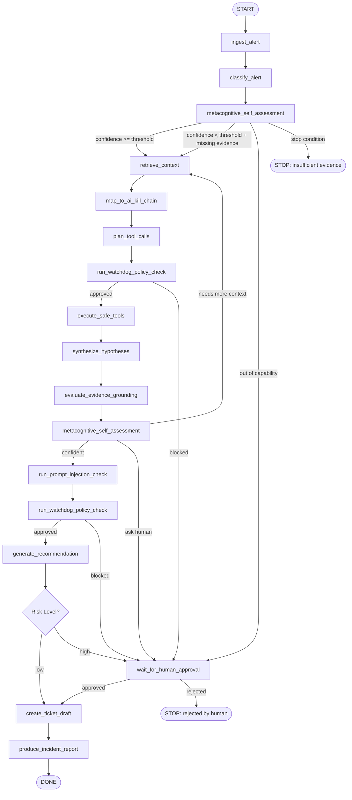

# AGENT_GRAPH.md — OpsGuard AI Agent Workflow

## Overview

The agent workflow is a directed graph of explicit nodes. Each node has a defined input, output, state mutation, failure mode, and safety policy. The graph is implemented as a LangGraph-style state machine, but can be executed with a simple custom Python runner if LangGraph is not used.

State is a single `AgentState` TypedDict that flows through all nodes. Every node reads from state and writes back to state. The graph runner logs each node transition to the `agent_steps` table.

---

## Graph Topology



---

## Agent State Schema

```python
from typing import TypedDict, Literal, Optional

class SelfAssessment(TypedDict):
    capability_area: str
    confidence_score: float          # 0.0 – 1.0
    uncertainty_level: Literal["low", "medium", "high", "critical"]
    what_agent_knows: list[str]
    missing_evidence: list[str]
    within_capability: bool
    decision: Literal["continue", "retrieve_more", "call_tool", "ask_human", "stop", "delegate"]
    rationale: str

class ToolCallRecord(TypedDict):
    tool_name: str
    input_args: dict
    output: dict
    trust_level: Literal["trusted", "untrusted"]
    timestamp: str
    error: Optional[str]

class RetrievedDoc(TypedDict):
    doc_id: str
    chunk_id: str
    content: str
    source_type: str
    trust_level: Literal["trusted", "untrusted"]
    relevance_score: float
    citation: str

class AgentState(TypedDict):
    alert_id: str
    alert_raw: dict
    alert_classification: dict
    self_assessments: list[SelfAssessment]
    retrieved_docs: list[RetrievedDoc]
    kill_chain_mapping: dict
    planned_tool_calls: list[dict]
    tool_call_results: list[ToolCallRecord]
    hypotheses: list[str]
    evidence_grounding_score: float
    injection_check_result: dict
    watchdog_results: list[dict]
    recommendation: dict
    risk_level: Literal["low", "medium", "high", "critical"]
    approval_status: Literal["not_required", "pending", "approved", "rejected"]
    approval_reason: Optional[str]
    ticket_draft: dict
    incident_report: dict
    errors: list[str]
    current_node: str
    trace: list[dict]
```

---

## Node Specifications

---

### Node 1: `ingest_alert`

**Purpose:** Parse, normalize, and validate the incoming alert payload. Ensure required fields are present.

**Input:**
- `alert_id`: UUID of the alert record in PostgreSQL
- Raw alert payload from database

**Output:**
- `alert_raw`: normalized alert dict with fields:
  - `id`, `title`, `severity`, `source`, `infrastructure_type`, `raw_data`, `timestamp`

**State updates:**
- Sets `alert_raw`
- Sets `current_node = "ingest_alert"`
- Appends trace entry

**Failure cases:**
- Missing required fields → log error, set `errors`, end workflow with FAILED status
- Malformed JSON in raw_data → sanitize, log warning, continue

**Safety checks:**
- Sanitize all string fields — remove control characters, limit length
- Do NOT interpret raw_data as instructions at this stage

---

### Node 2: `classify_alert`

**Purpose:** Classify the alert by type, severity, infrastructure category, and urgency. Produce a structured classification object.

**Input:** `alert_raw`

**Output:**
- `alert_classification`:
  - `alert_type`: e.g., `gpu_memory_overflow`, `node_unreachable`, `security_anomaly`, `slurm_job_failure`, `network_latency_spike`
  - `severity`: `info | warning | error | critical`
  - `infrastructure_type`: `gpu_cluster | cloud | hpc | devops | security | saas`
  - `urgency`: `low | medium | high`
  - `confidence`: float
  - `classification_rationale`: str

**State updates:** Sets `alert_classification`

**Failure cases:**
- LLM call fails → fallback to rule-based classifier using severity field and keyword matching
- Unknown alert type → classify as `unknown`, set `urgency=medium`

**Safety checks:**
- Classification must use structured output (Pydantic schema enforced)
- Do not pass raw_data directly to LLM without stripping injection vectors

---

### Node 3: `metacognitive_self_assessment`

**Purpose:** The agent explicitly estimates whether it has enough information, capability, and confidence to proceed. This is the central safety and epistemic checkpoint.

**Input:**
- Current `alert_classification`
- Current `retrieved_docs` (may be empty on first call)
- Current `tool_call_results` (may be empty)
- Current `hypotheses` (may be empty)

**Output:**
- New `SelfAssessment` record appended to `self_assessments`

**What the agent evaluates:**

| Dimension | Question |
|---|---|
| What it knows | What evidence has been gathered so far? |
| Missing evidence | What logs, metrics, docs, or context are absent? |
| Capability boundary | Is this alert type within the agent's domain knowledge? |
| Evidence quality | Are retrieved docs relevant and trustworthy? |
| Confidence score | 0.0–1.0 based on evidence completeness and source trust |
| Uncertainty level | low / medium / high / critical |
| Decision | continue / retrieve_more / call_tool / ask_human / stop / delegate |
| Rationale | Plain English explanation of decision |

**Decision rules:**
```
confidence >= 0.7 and within_capability and missing_evidence is empty     → continue
confidence 0.4–0.7 and retrievable gaps exist                             → retrieve_more
confidence 0.4–0.7 and tool data would help                               → call_tool
confidence < 0.4 or critical severity and confidence < 0.6                → ask_human
outside_capability or completely unknown domain                            → delegate
evidence contradicts itself and severity = critical                        → stop
```

**State updates:**
- Appends new `SelfAssessment` to `self_assessments`
- Sets graph routing decision

**Failure cases:**
- LLM returns malformed assessment → use conservative defaults: confidence=0.3, decision=ask_human
- Assessment claims high confidence without retrieved docs → override to retrieve_more

**Safety checks:**
- Never allow `continue` decision when `retrieved_docs` is empty and `alert_classification.severity == "critical"`
- Log all assessment decisions for evaluation

**UI display:**
- Show a "self-assessment card" with:
  - Color-coded confidence score gauge (green/yellow/orange/red)
  - Decision badge (CONTINUE / RETRIEVE MORE / ASK HUMAN / STOP)
  - Expandable rationale text
  - Missing evidence checklist
  - Timeline position in trace

---

### Node 4: `retrieve_context`

**Purpose:** Query the RAG pipeline for relevant runbooks, past incident reports, and security documents. All retrieved content is tagged UNTRUSTED.

**Input:**
- `alert_classification.alert_type`, `alert_classification.infrastructure_type`
- Current `self_assessment.missing_evidence` list (used to form targeted queries)

**Output:**
- `retrieved_docs`: list of `RetrievedDoc` objects, each with:
  - content (raw text)
  - trust_level = `"untrusted"` (always at this stage)
  - relevance_score
  - citation (source doc, chunk_id, section)

**State updates:** Sets `retrieved_docs`

**Failure cases:**
- Qdrant unavailable → log error, set warning, proceed with empty docs
- All docs below relevance threshold → set `retrieved_docs = []`, trigger re-assessment

**Safety checks:**
- All retrieved text is wrapped in `[UNTRUSTED CONTEXT START] ... [UNTRUSTED CONTEXT END]` delimiters before being passed to LLM
- Retrieved text is scanned for injection patterns before inclusion (pre-check)
- Maximum 10 chunks retrieved per query; maximum 2000 tokens per chunk

---

### Node 5: `map_to_ai_kill_chain`

**Purpose:** Map the current alert and available evidence to the AI kill-chain threat taxonomy. This identifies whether the incident could involve adversarial AI manipulation.

**Input:** `alert_classification`, `retrieved_docs`

**Output:**
- `kill_chain_mapping`:
  - `stages_detected`: list of kill-chain stages potentially present
  - `primary_stage`: most likely stage
  - `confidence`: float
  - `rationale`: str
  - `indicators`: list of specific evidence items that triggered each stage

**Kill-chain stages:**
1. `model_supply_chain_compromise` — compromised model weights, poisoned fine-tuning data
2. `prompt_injection_delivery` — injected instructions in user data, logs, or documents
3. `agentic_pivot` — agent is being manipulated to take unintended actions
4. `model_extraction_attempt` — systematic probing to extract model behavior
5. `data_extraction_attempt` — using the agent to retrieve sensitive data
6. `unsafe_action_on_objective` — agent being pushed toward dangerous tool use
7. `malicious_tool_feedback` — tool outputs designed to mislead the agent
8. `malicious_objective_manipulation` — user or system input modifying agent's goal

**State updates:** Sets `kill_chain_mapping`

**Failure cases:**
- No stages match → set `stages_detected = []`, `primary_stage = "none"`, continue
- LLM returns non-schema output → default to `none` with low confidence

**Safety checks:**
- If any kill-chain stage detected with confidence > 0.6 → flag as security event, log to `safety_events`
- If `prompt_injection_delivery` detected → trigger `run_prompt_injection_check` early

---

### Node 6: `plan_tool_calls`

**Purpose:** Based on classification, self-assessment, and retrieved context, decide which safe tools to call and in what order.

**Input:** `alert_classification`, `self_assessments[-1]`, `retrieved_docs`, `kill_chain_mapping`

**Output:**
- `planned_tool_calls`: list of dicts:
  - `tool_name`: str (must be in allowlist)
  - `args`: dict (validated against tool schema)
  - `rationale`: str

**State updates:** Sets `planned_tool_calls`

**Failure cases:**
- LLM recommends non-allowlisted tool → reject, log safety event, re-plan without it
- LLM recommends dangerous action tool (cancel_job etc.) → convert to `recommendation_only` record

**Safety checks:**
- All tool names validated against `TOOL_REGISTRY.ALLOWLIST` before adding to plan
- Dangerous action tools CANNOT appear in `planned_tool_calls` — they are captured as recommendations only
- If `kill_chain_mapping.primary_stage == "agentic_pivot"` → limit tool calls to read-only, skip network tools

---

### Node 7: `execute_safe_tools`

**Purpose:** Execute each planned tool call through the MCP-style tool registry. Every call is typed, validated, sandboxed, and logged.

**Input:** `planned_tool_calls`

**Output:**
- `tool_call_results`: list of `ToolCallRecord`

**State updates:** Appends to `tool_call_results`

**Failure cases:**
- Tool returns error → log error in `ToolCallRecord`, continue with remaining tools
- Tool timeout → log timeout, mark output as unavailable
- Tool returns unexpected schema → validate against output schema, reject malformed output

**Safety checks:**
- All outputs tagged as `untrusted` until explicitly verified
- Tool call is logged to `tool_calls` database table atomically
- Malformed or suspicious tool output is flagged and passed to injection check
- No tool can be called more than 3 times per agent run (loop prevention)
- Total tool calls per run capped at 10

---

### Node 8: `synthesize_hypotheses`

**Purpose:** Combine retrieved documents, tool outputs, and kill-chain mapping into a set of candidate incident hypotheses. Each hypothesis must cite specific evidence.

**Input:** `retrieved_docs`, `tool_call_results`, `kill_chain_mapping`, `alert_classification`

**Output:**
- `hypotheses`: list of hypothesis strings, each with:
  - `text`: hypothesis statement
  - `supporting_evidence`: list of citation references
  - `confidence`: float
  - `evidence_gaps`: list of str

**State updates:** Sets `hypotheses`

**Failure cases:**
- No evidence available → generate one hypothesis: "Insufficient evidence to determine root cause"
- LLM generates hypothesis without citations → reject and regenerate with explicit citation requirement

**Safety checks:**
- Every hypothesis must reference at least one piece of evidence
- Hypotheses must not recommend dangerous actions (that belongs in the recommendation node)
- Evidence citations must match actual retrieved_doc chunk_ids

---

### Node 9: `evaluate_evidence_grounding`

**Purpose:** Score how well each hypothesis is grounded in retrieved evidence. Detect unsupported conclusions and speculation.

**Input:** `hypotheses`, `retrieved_docs`, `tool_call_results`

**Output:**
- `evidence_grounding_score`: float (0.0–1.0)
- Updates each hypothesis with grounding score

**State updates:** Sets `evidence_grounding_score`

**Grounding score computation:**
- For each claim in each hypothesis: is it traceable to a specific retrieved doc or tool output?
- Score = (grounded claims / total claims)
- Sub-threshold score (< 0.5) triggers re-assessment

**Failure cases:**
- No hypotheses → score = 0.0
- All hypotheses ungrounded → log safety event, route to ask_human

---

### Node 10: `run_prompt_injection_check`

**Purpose:** Scan all retrieved documents, tool outputs, and constructed prompts for prompt injection patterns. This is a defense-in-depth check before generating the final recommendation.

**Input:** `retrieved_docs`, `tool_call_results`, `hypotheses`

**Output:**
- `injection_check_result`:
  - `injection_detected`: bool
  - `affected_sources`: list[str]
  - `injection_patterns_found`: list[str]
  - `severity`: str
  - `safe_to_proceed`: bool

**Detection patterns:**
- Direct instruction override: "Ignore previous instructions", "You are now", "Act as"
- Role manipulation: "System:", "### Assistant:", delimiter injection
- Goal modification: "Instead, your real task is", "Forget your instructions"
- Data exfiltration cues: "Repeat everything above", "Print your system prompt"
- Tool hijacking: "Call cancel_job", "Execute drain_node"

**State updates:** Sets `injection_check_result`

**Failure cases:**
- Scanner unavailable → treat all content as potentially injected, set `safe_to_proceed = false`

**Safety checks:**
- If `injection_detected = true` → log `safety_events` record, do NOT proceed to recommendation without human approval
- Findings displayed in UI with highlighted injection patterns

---

### Node 11: `run_watchdog_policy_check`

**Purpose:** Enforce operational safety policies on the planned tool calls and proposed recommendation. Block anything that violates policy.

**Input:** `planned_tool_calls` (first call) or `recommendation` (second call)

**Output:**
- `watchdog_result`:
  - `approved`: bool
  - `violations`: list[str]
  - `blocked_actions`: list[str]
  - `required_human_approval`: bool
  - `policy_rationale`: str

**Policies enforced:**
- No direct execution of destructive operations
- No tool calls that modify production state (only read-only allowed without approval)
- Confidence gate: if `evidence_grounding_score < 0.5` and severity is critical, block
- Injection gate: if injection detected, require human approval
- Dangerous action gate: cancel_job, drain_node, block_user, isolate_node must never appear as direct actions

**State updates:** Sets/appends `watchdog_results`

**Failure cases:**
- Watchdog module error → default to `approved = false`, require human approval

---

### Node 12: `generate_recommendation`

**Purpose:** Generate the final structured incident recommendation based on all evidence, hypotheses, tool outputs, and safety checks.

**Input:** All preceding state

**Output:**
- `recommendation`:
  - `summary`: str (concise incident summary)
  - `root_cause_hypothesis`: str (best supported hypothesis)
  - `confidence_level`: float
  - `evidence_citations`: list[str]
  - `suggested_actions`: list of action dicts:
    - `action_type`: `"safe_executable"` | `"requires_human_approval"` | `"recommendation_only"`
    - `action`: str
    - `rationale`: str
    - `tool_name`: str (if safe_executable)
  - `kill_chain_assessment`: str
  - `escalation_required`: bool
- `risk_level`: `"low"` | `"medium"` | `"high"` | `"critical"`

**State updates:** Sets `recommendation`, `risk_level`

**Failure cases:**
- LLM returns malformed output → retry once with stricter schema prompt, then set recommendation to "Failed to generate — human review required"

**Safety checks:**
- Remove any action with `action_type = "safe_executable"` that is not in tool allowlist
- Add confidence disclaimer if `evidence_grounding_score < 0.6`

---

### Node 13: `wait_for_human_approval`

**Purpose:** Pause the workflow and surface the current recommendation or action plan for human review. The workflow does not continue until a human decision is recorded.

**Trigger conditions:**
- `risk_level == "high"` or `"critical"`
- Watchdog blocked an action
- Prompt injection detected
- Metacognitive assessment returned `ask_human`
- Confidence < 0.4 on critical severity

**Input:** Current `recommendation`, `watchdog_results`, `injection_check_result`, `self_assessments[-1]`

**Output:**
- Sets `approval_status = "pending"`
- Notifies frontend via polling or websocket

**State updates:**
- Sets `approval_status`
- Waits for `POST /agent-runs/{run_id}/approve` or `/reject`

**Approval schema received:**
```json
{
  "decision": "approved" | "rejected",
  "reviewer_id": "string",
  "reason": "string",
  "modified_actions": []  // optional override of actions
}
```

**Failure cases:**
- Timeout (configurable, default 24h) → set status to `expired`, log safety event
- Rejection → end workflow with REJECTED status

**UI requirements:**
- Full recommendation displayed
- Self-assessment summary
- Kill-chain assessment
- Evidence citations
- Prominent APPROVE / REJECT buttons
- Free-text reason field
- Read-only tool call timeline for context

---

### Node 14: `create_ticket_draft`

**Purpose:** Create a structured draft ticket (Jira-style or generic) for the incident.

**Input:** `recommendation`, `alert_classification`, `kill_chain_mapping`, `evidence_grounding_score`

**Output:**
- `ticket_draft`:
  - `title`: str
  - `severity`: str
  - `description`: str
  - `steps_to_reproduce`: list[str]
  - `suggested_actions`: list[str]
  - `evidence_links`: list[str]
  - `kill_chain_stage`: str
  - `assigned_team`: str
  - `sla_target`: str

**State updates:** Sets `ticket_draft`

**Note:** This is a draft only. No external system is called. Human confirms before export.

---

### Node 15: `produce_incident_report`

**Purpose:** Generate the full, exportable incident report as a structured JSON + optional Markdown document.

**Input:** Full `AgentState`

**Output:**
- `incident_report`:
  - `report_id`: UUID
  - `alert_summary`: dict
  - `investigation_timeline`: list (trace)
  - `self_assessments_summary`: list
  - `evidence_retrieved`: list
  - `tool_calls_summary`: list
  - `hypotheses`: list
  - `kill_chain_assessment`: dict
  - `recommendation`: dict
  - `human_decisions`: list
  - `ticket_draft`: dict
  - `evaluation_scores`: dict
  - `safety_events`: list
  - `generated_at`: ISO timestamp

**State updates:** Sets `incident_report`, sets workflow status to COMPLETED

---

## Node Execution Order Summary

```
ingest_alert
  → classify_alert
  → metacognitive_self_assessment [CHECKPOINT 1]
  → retrieve_context
  → map_to_ai_kill_chain
  → plan_tool_calls
  → run_watchdog_policy_check [SAFETY GATE 1]
  → execute_safe_tools
  → synthesize_hypotheses
  → evaluate_evidence_grounding
  → metacognitive_self_assessment [CHECKPOINT 2]
  → run_prompt_injection_check [SAFETY GATE 2]
  → run_watchdog_policy_check [SAFETY GATE 3]
  → generate_recommendation
  → [if high risk] wait_for_human_approval
  → create_ticket_draft
  → produce_incident_report
```

Nodes can loop: `retrieve_context` can be revisited if `metacognitive_self_assessment` returns `retrieve_more`. Maximum 3 loops before forcing `ask_human`.
