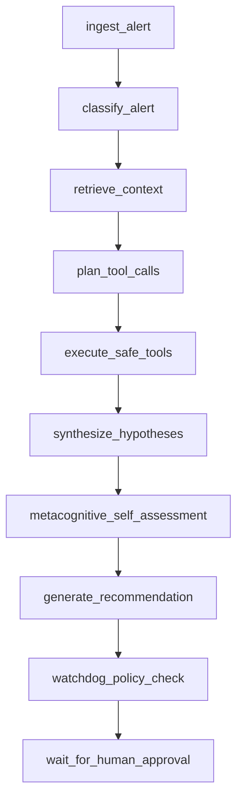

# Agent Workflow

OpsGuard runs a fixed incident-triage workflow that records evidence, local tool calls, confidence estimates, and policy findings. The runner executes synchronously within the API request.

## Execution flow

[run_agent_for_alert](../backend/app/agent/runner.py) creates an `AgentRun` for an existing alert and executes these nodes in order:

The node names above are the names stored in traces. This is a sequential Python runner, with no graph engine, retrieval loop, delegation, or approval-resume branch.

| Node | Current behavior |
| --- | --- |
| `ingest_alert` | Load the alert, build its summary, and add its description as untrusted evidence. |
| `classify_alert` | Ask the configured provider for a typed incident category, query hint, self-assessed confidence, and initial evidence gaps. |
| `retrieve_context` | Run local lexical retrieval and preserve excerpts, citations, trust labels, and suspicious-content indicators. |
| `plan_tool_calls` | Choose tools for the incident category; omit target-specific checks and proposals when the alert lacks a valid target. |
| `execute_safe_tools` | Record typed outcomes and audit IDs; only successful observations with persisted identities become evidence. Failed or blocked attempts create evidence gaps. |
| `synthesize_hypotheses` | Ask the provider for structured hypotheses and validate supporting IDs against this run's evidence. |
| `metacognitive_self_assessment` | Record bounded self-assessed confidence, uncertainty, capability label, and missing-evidence notes. Deterministic mode uses its documented arithmetic heuristic. |
| `generate_recommendation` | Validate provider narrative/actions, attach the application-owned evidence snapshot, and persist an unvalidated candidate; no ticket yet. |
| `watchdog_policy_check` | Evaluate eight policies, persist a typed decision, mark the recommendation pending review or blocked, then create the labeled local ticket for recognized categories. |
| `wait_for_human_approval` | End with run status `waiting_for_human` and approval status `pending`. |

Node implementations are in [nodes.py](../backend/app/agent/nodes.py); tool selection is in [planner.py](../backend/app/agent/planner.py).

## Reasoning and state

[AgentState](../backend/app/agent/state.py) is a Pydantic model containing the alert summary, classification, retrieved context, tool results, evidence, hypotheses, planned and blocked tools, assessment, recommendation, watchdog decision, trace, and errors.

[providers](../backend/app/agent/providers) defines the typed interface, request/result contracts, context builder, deterministic implementation, OpenAI Responses implementation, error mapping, and configuration factory. The deterministic implementation preserves the existing local rules in [deterministic_rules.py](../backend/app/agent/deterministic_rules.py) behind `DeterministicProvider`. It remains the default and the mandatory CI/harness provider.

Provider context contains the current alert, run-scoped evidence snapshots and IDs, trust/status metadata, suspicious observations, evidence/target gaps, prior hypotheses, blocked action definitions, and the allowed action vocabulary. It contains no database objects, API credentials, handler implementations, or unrelated history. OpenAI output uses a Pydantic schema and cannot directly invoke tools. Each run records provider, model, local/external mode, implementation/schema version, provider-call duration, safe response IDs, and optional token counts.

Deterministic confidence is an arithmetic function of classification, evidence count, suspicious items, and missing evidence. OpenAI confidence is model self-assessment. Both are constrained to `[0,1]` and are not calibrated probabilities. Application-level gaps and watchdog checks remain authoritative. Assessment decisions such as `retrieve_more` and `stop_and_request_human_review` are recorded labels; they do not change node routing.

## Evidence identity and outcomes

`EvidenceItem` validates each new observation's source type and identity. It records a run-scoped `evidence_id`, alert/document/chunk/tool-call IDs as applicable, retrieval score, trust label, content snapshot, and timezone-aware `observed_at`. Retrieval content is the exact excerpt supplied to the agent; tool content is the structured output of that particular call. For tools, `observed_at` records invocation time; any original infrastructure timestamps remain inside the output snapshot. The model rejects quarantined supporting evidence.

Hypotheses use evidence IDs, and recommendation citations identify exact run/chunk or tool-call observations. Generated recommendations must retain all recorded evidence without truncation. Validation rejects references outside the run. This verifies identity and retention, not whether a hypothesis follows logically from its sources.

Internal agent observation outcomes retain `succeeded`, `failed`, and `blocked`. The execution API and authoritative audit use `succeeded`, `failed`, and `denied`; `handler_invoked` independently records handler entry. Legacy `status` values remain for observation compatibility. Failed and blocked attempts stay in `tool_results` and the audit trail; they do not appear in supporting evidence or the successful `executed_tools` list.

## Persistence and errors

The shared `_run_node` helper records input/output snapshots, step status, duration, and error text in `AgentStep`. The workflow also writes `SelfAssessment`, `ToolCall`, `SafetyEvent`, and optional `TicketDraft` rows. The tool dispatcher owns `ToolExecutionAudit` and its separate transaction boundary. The orchestration layer commits run/step identities before dispatch; handlers only add/flush local effects. Requested/invoked checkpoints persist independently, effects commit with success, and failures roll back effects before recording failure. Caller rollback leaves required tool audit records intact.

A successful investigation returns `waiting_for_human`. The runner attempts to mark exceptions as `failed`; earlier committed steps can remain available. Run details reconstruct the recommendation from step snapshots and the assessment from stored records. Inspect run status and failed steps before using a partially generated recommendation.

## Safety boundary

The [Tool Registry](TOOL_REGISTRY.md) exposes local data adapters and permanently blocked destructive definitions. The watchdog adds policy findings after recommendation generation. Every successful run stops for human review; there is no implemented approve/reject endpoint, authenticated reviewer workflow, or infrastructure execution after approval.

The candidate snapshot contains typed [actions](../backend/app/agent/actions.py): type, target, parameters, risk, approval requirement, evidence IDs and rationale. It always starts with `lifecycle_state: candidate`, `review_valid: false`, no ticket and no policy decision, regardless of provider-supplied labels. After evaluation the watchdog step persists the exact decision and transitions to `pending_human_review` or `blocked`; only then is its ticket created with matching lifecycle and policy-version metadata. Blocked artifacts are retained but never marked review-valid. A standalone ticket request remains a candidate without completed policy review.

Evidence, tool observations, hypotheses, proposals and recommendation prose occupy separate state fields. Action checks inspect typed proposals first and screen intent-bearing prose as fallback. Reference integrity requires same-run valid observations; failed/blocked tool calls and quarantined sources cannot support claims. This does not establish semantic support. Watchdog output includes exact verdict, finding IDs/types, severity, affected actions, blocking/review flags, reason and policy version. All successful workflows still terminate at human review even when the policy verdict is `allow`.

Evidence and policy checks remain deterministic engineering controls. Hypotheses use templates, claim-level semantic support is not verified, and injection screening covers configured patterns. Historical snapshots preserve the recorded trust and content even after a source changes; they are ordinary SQL records, not tamper-evident storage. Older records without complete provenance are not backfilled. These limits are described in [Retrieval and Evidence](RAG_DESIGN.md) and [Security Boundaries](SECURITY_BOUNDARIES.md).
