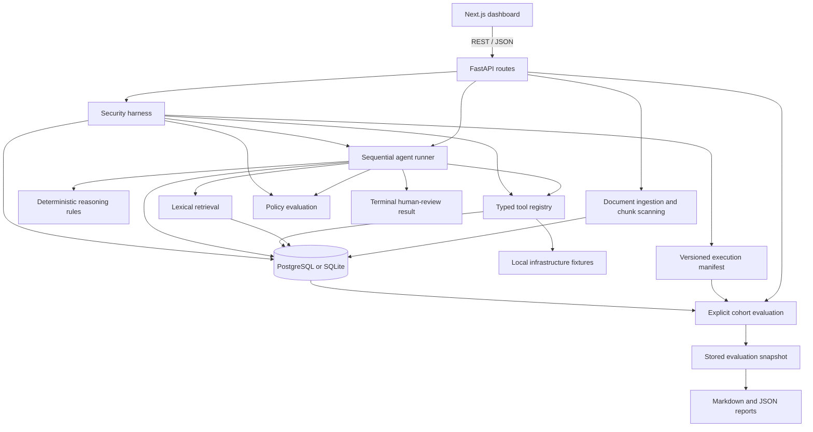

# Architecture

OpsGuard combines incident investigation, local document retrieval, typed tool execution, policy checks, and evaluation reporting in one application. The current reasoning and infrastructure responses are deterministic; SQL persistence, retrieval, workflow execution, and report generation are implemented services.

## Components and data flow

The diagram shows active application components. Qdrant is present in Compose but has no role in ingestion or retrieval.

| Component | Implementation |
| --- | --- |
| Frontend | Next.js 15, React 19, TypeScript, Tailwind; [dashboard-shell.tsx](../frontend/components/dashboard/dashboard-shell.tsx) coordinates requests and React state |
| API | FastAPI routers and Pydantic request/response schemas registered in [main.py](../backend/app/main.py) |
| Agent | Fixed ten-node workflow in [runner.py](../backend/app/agent/runner.py) and [nodes.py](../backend/app/agent/nodes.py) |
| Reasoning | Keyword classification, hypothesis/recommendation templates, and confidence arithmetic in [mock_llm.py](../backend/app/agent/mock_llm.py) |
| Retrieval | SQL document ingestion, character chunking, and lexical ranking in [app/rag](../backend/app/rag) |
| Tools | Immutable typed registry, local handlers, and run-linked audit records in [app/tools](../backend/app/tools) |
| Watchdog | Seven deterministic policies and decision aggregation in [app/watchdog](../backend/app/watchdog) |
| Harness | Python scenario definitions, execution, scoring, and persistence in [app/harness](../backend/app/harness) |
| Evaluation | Explicit executed cohorts, raw metric counts, immutable report snapshots, and report rendering in [app/evaluation](../backend/app/evaluation) |
| Persistence | SQLModel tables and SQLAlchemy sessions in [app/models](../backend/app/models) and [app/db](../backend/app/db) |

## An investigation

1. Fixture seeding creates alerts and reference data. `POST /api/v1/agent/runs` starts an investigation for an existing alert ID.
2. The runner records the alert, classifies it, retrieves document excerpts, and selects tools from a fixed incident-category plan.
3. Local tools return infrastructure fixtures, search stored incidents/runbooks, or persist a ticket draft. Destructive tool definitions return blocked results.
4. The reasoning rules assemble hypotheses, an assessment, and a recommendation. Recognized categories receive a local ticket draft at this stage.
5. The watchdog evaluates the assembled context and annotates the recommendation. The runner ends in `waiting_for_human` with approval `pending`.

This work occurs synchronously in the API request. Steps, assessments, calls, and findings are committed incrementally. There is no task queue, adaptive agent loop, external reasoning provider, or approval-resume implementation. See [Agent Workflow](AGENT_GRAPH.md) for the exact node sequence and error behavior.

## Frontend/backend contract

The frontend has a landing route and `/dashboard`. It displays run traces, tool results, retrieved context, watchdog findings, harness results, and evaluation summaries. Alert overview cards describe fixed fixture scenarios; there is no live alert-list API.

[api.ts](../frontend/lib/api.ts) is a handwritten fetch client. [types.ts](../frontend/lib/types.ts) contains corresponding TypeScript types; these are not generated from OpenAPI and do not validate received JSON at runtime. The browser uses [API_BASE_URL](../frontend/lib/config.ts), which defaults to `http://localhost:8000/api/v1`.

The backend exposes its schemas through `/openapi.json` and interactive documentation through `/docs`. See [API Reference](API_SPEC.md) for the implemented route inventory.

## Evidence and policy

Retrieval requires meaningful lexical overlap and resolves trust restrictively across document, chunk, and metadata labels. Public ingestion can supply untrusted or quarantined content; internal provisioning is required to create trusted sources. Quarantined chunks never enter retrieval.

Agent snapshots preserve source identities, excerpts or structured tool output, trust, and observation timestamps. Final recommendations retain the complete evidence set, and hypothesis references are checked against its run-scoped identifiers. Only successful tool observations with persisted call IDs become evidence. The dashboard reads stored snapshots without fresh retrieval. Confidence and grounding scores remain engineering heuristics, with no claim-level semantic support verification.

Tool execution is constrained by registered handlers rather than prompt instructions. The watchdog inspects context and recommendations using deterministic rules. It does not grant tool authority, and its `block` status does not remove the earlier local ticket draft. Human review is a terminal state, not an authenticated approval service.

See [Retrieval and Evidence](RAG_DESIGN.md), [Tool Registry](TOOL_REGISTRY.md), and [Security Boundaries](SECURITY_BOUNDARIES.md) for the current limitations.

## Evaluation and storage

The harness combines one end-to-end investigation case, two component cases, five policy cases, and one tool-boundary case. It first stores a versioned execution manifest, then records observed case outcomes and mandatory assertions. New results use strict pass/fail; historical partial results remain labeled as historical. Prewritten seeded results have fixture provenance and cannot satisfy an execution requirement.

Evaluation selects a completed executed manifest and follows its exact workflow/component run relationships. It stores the cohort, scenario definitions/versions, provider/policy versions, case observations, and each metric's numerator, denominator, value, and definition in a separate report snapshot. Human-review and evidence metrics include only actual end-to-end workflows. JSON and Markdown exports render the selected snapshot without recomputing from global history. These outputs describe application assertions and recorded identities; they do not establish real-model robustness, semantic correctness, or calibration. There is no overall safety score.

PostgreSQL is the default database. SQLite is available through an explicit `DATABASE_URL`; there is no automatic failover. SQL tables store document content and execution records, with JSON snapshots for nested state. Additive compatibility initialization creates missing tables and provenance fields without a schema-migration framework. Legacy evaluation JSON is retained as labeled history; unidentified old executions are not upgraded into benchmark evidence.

[Data Model](DATA_MODEL.md), [Security Harness](SECURITY_HARNESS.md), and [Evaluation](EVALUATION.md) describe these components in detail.

## Local deployment

[docker-compose.yml](../docker-compose.yml) defines frontend, backend, PostgreSQL, and Qdrant services with persistent database volumes. The backend depends on Qdrant startup in Compose despite not using it in application logic. The Dockerfiles run application processes as non-root users.

Compose publishes frontend, API, database, and Qdrant ports without restricting them to a loopback address. The API has no authentication, and the backend container listens on `0.0.0.0`. Treat this as a local development configuration and review network exposure before starting it on a shared host. Installation and current startup guidance are in the [README](../README.md).
