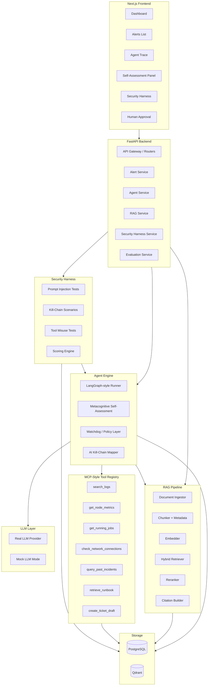

# ARCHITECTURE.md — OpsGuard AI

## System Overview

OpsGuard AI is a full-stack, production-style agentic AI system. It is not a chatbot wrapper. It is an engineered pipeline with explicit nodes, typed tool calls, hybrid RAG retrieval, metacognitive self-assessment, a safety watchdog, and a built-in AI security harness.

All components run locally with Docker Compose. No paid API keys are required in demo mode.

---

## High-Level Architecture

```
┌─────────────────────────────────────────────────────────────────┐
│                        Next.js Frontend                         │
│  Dashboard · Alerts · Trace · Self-Assessment · Security Harness│
└────────────────────────┬────────────────────────────────────────┘
                         │ REST/JSON
┌────────────────────────▼────────────────────────────────────────┐
│                     FastAPI Backend                             │
│  Routers · Schemas · Services · Auth middleware                 │
└──┬──────────────┬──────────────┬──────────────┬─────────────────┘
   │              │              │              │
   ▼              ▼              ▼              ▼
PostgreSQL     Qdrant        Agent          Security
(SQLModel)   Vector DB      Engine         Harness
   │              │          (LangGraph     Runner
   │              │           -style)
   │              │              │
   │              │    ┌─────────▼────────┐
   │              │    │  Agent Workflow  │
   │              │    │  (Multi-node)    │
   │              │    │                 │
   │              │    │ ┌─────────────┐ │
   │              │    │ │Metacognitive│ │
   │              │    │ │Self-Assess  │ │
   │              │    │ └─────────────┘ │
   │              │    │                 │
   │              │    │ ┌─────────────┐ │
   │              │    │ │  Watchdog   │ │
   │              │    │ │Safety Layer │ │
   │              │    │ └─────────────┘ │
   │              │    └────────┬────────┘
   │              │             │
   │              │    ┌────────▼────────┐
   │              └───►│  RAG Pipeline  │
   │                   │ (Hybrid Retriev)│
   │                   └────────────────┘
   │
   └── Tool Registry (MCP-style)
       search_logs · get_node_metrics · get_running_jobs
       check_network_connections · query_past_incidents
       retrieve_runbook · create_ticket_draft
```

---

## Mermaid Architecture Diagram



---

## Component Details

### Frontend (Next.js)

**Technology:** Next.js 14+, TypeScript, Tailwind CSS, shadcn/ui components

**Responsibilities:**
- Display alerts, investigations, agent traces
- Self-assessment panel with confidence scores and decision rationale
- Human approval modal for risky recommendations
- Security harness test runner and results display
- Evaluation metrics panel
- Incident report export

**Key pages:**
- `/` — Landing page with project pitch and demo entry point
- `/dashboard` — Ops overview: active alerts, recent runs, safety events
- `/alerts` — Alert list with severity, status, classification
- `/alerts/[id]` — Alert detail with full investigation trace
- `/alerts/[id]/trace` — Step-by-step agent execution graph
- `/alerts/[id]/self-assessment` — Metacognitive assessment panel
- `/alerts/[id]/tools` — Tool calls timeline
- `/alerts/[id]/evidence` — Retrieved documents with citations
- `/alerts/[id]/kill-chain` — AI kill-chain mapping overlay
- `/alerts/[id]/approve` — Human approval panel
- `/safety` — Safety events log
- `/harness` — Security harness test runner
- `/harness/[run_id]` — Harness run results
- `/evaluation` — Evaluation metrics dashboard
- `/reports` — Incident report export

**State management:** React Query for server state, Zustand for UI state

**API communication:** Typed fetch client generated from FastAPI OpenAPI spec

---

### Backend (FastAPI)

**Technology:** FastAPI, Python 3.11, Pydantic v2, SQLModel, Uvicorn

**Responsibilities:**
- REST API for all frontend operations
- Orchestrates agent runs
- Manages document ingestion
- Runs security harness
- Computes evaluation scores
- Manages human approval workflow

**Structure:**
```
backend/
├── app/
│   ├── main.py              # FastAPI app, router registration
│   ├── config.py            # Settings from env vars
│   ├── database.py          # SQLModel engine, session factory
│   ├── routers/
│   │   ├── alerts.py
│   │   ├── documents.py
│   │   ├── rag.py
│   │   ├── agent_runs.py
│   │   ├── feedback.py
│   │   ├── security_harness.py
│   │   ├── safety_events.py
│   │   ├── reports.py
│   │   └── demo.py
│   ├── models/              # SQLModel table definitions
│   ├── schemas/             # Pydantic request/response schemas
│   ├── services/            # Business logic
│   ├── agent/               # Agent engine
│   ├── rag/                 # RAG pipeline
│   ├── tools/               # MCP-style tool registry
│   ├── harness/             # Security harness
│   ├── evaluation/          # Evaluation engine
│   └── utils/
```

---

### Agent Engine

**Technology:** Custom LangGraph-style graph runner (explicit Python, no heavy framework required), optionally LangGraph if available

**Responsibilities:**
- Execute multi-node agent workflow
- Maintain agent state across nodes
- Run metacognitive self-assessment at key decision points
- Enforce watchdog policy checks
- Manage human approval handoff
- Log every step to PostgreSQL

**Agent state schema (TypedDict):**
```python
class AgentState(TypedDict):
    alert_id: str
    alert_data: dict
    classification: dict
    self_assessment: SelfAssessment
    retrieved_docs: list[RetrievedDoc]
    kill_chain_mapping: dict
    tool_calls: list[ToolCallRecord]
    hypotheses: list[str]
    evidence_grounding_score: float
    injection_check_result: dict
    watchdog_result: dict
    recommendation: dict
    approval_status: str        # pending | approved | rejected
    ticket_draft: dict
    incident_report: dict
    errors: list[str]
    trace: list[TraceStep]
```

---

### RAG Pipeline

**Technology:** LlamaIndex or custom, Qdrant, sentence-transformers or OpenAI embeddings (pluggable)

**Responsibilities:**
- Ingest runbooks, incident reports, security docs, operational docs
- Chunk with metadata preservation
- Embed and store in Qdrant
- Hybrid retrieval: dense vector + sparse BM25
- Rerank results by relevance
- Tag retrieved text as UNTRUSTED
- Build citations with source document, chunk ID, page reference

**Document types:**
- Runbooks (YAML, Markdown)
- Incident reports (Markdown, JSON)
- Security policies (Markdown)
- Operational checklists (Markdown)
- GPU/HPC cluster docs (Markdown)

---

### Vector Database (Qdrant)

**Collections:**
- `documents` — all ingested operational content
- `incidents` — past incident summaries for similarity search
- `security_scenarios` — harness attack payloads and expected behaviors

**Payload metadata per vector:**
- `doc_id`, `chunk_id`, `source_type`, `trust_level`, `created_at`, `tags`

**Qdrant runs as Docker container.** No external service required.

---

### PostgreSQL Database (SQLModel)

Stores all relational state:
- Alerts and their investigation status
- Agent runs and step traces
- Tool call audit log
- Self-assessment records
- Safety events
- Security harness test results
- Human feedback and approval decisions
- Evaluation scores

See DATA_MODEL.md for full schema.

---

### MCP-Style Tool Registry

**Principle:** Every tool is typed, allowlisted, sandboxed, and audited. No arbitrary shell execution.

**Tool categories:**
- **Read-only observability tools** — search_logs, get_node_metrics, get_running_jobs, check_network_connections
- **Knowledge retrieval tools** — query_past_incidents, retrieve_runbook
- **Action drafting tools** — create_ticket_draft

**Simulated dangerous actions** (recommendation only, never executed):
- cancel_job, drain_node, block_user, isolate_node, disable_service

All tool calls are logged to the `tool_calls` table with: tool_name, input, output, trust_level, timestamp, agent_run_id, step_id.

See TOOL_REGISTRY.md for full specifications.

---

### Metacognitive Self-Assessment Layer

Runs at key decision points in the agent workflow. The agent explicitly estimates:

1. **What it knows** — retrieved evidence quality, tool outputs available
2. **What is missing** — evidence gaps, unanswered questions
3. **Capability boundary** — is this within the agent's domain?
4. **Confidence score** — 0.0–1.0, derived from evidence quality
5. **Uncertainty level** — low / medium / high / critical
6. **Decision** — continue | retrieve_more | call_tool | ask_human | stop | delegate
7. **Rationale** — plain text explanation of the decision

This assessment is stored in `self_assessments` table and displayed prominently in the UI.

---

### Safety / Watchdog Layer

Runs before any recommendation is finalized. Checks:

1. **Prompt injection detection** — scans recommendation and evidence for injection patterns
2. **Policy enforcement** — blocks recommendations violating operational safety policies
3. **Dangerous action detection** — flags any tool call or recommendation involving destructive operations
4. **Evidence grounding check** — verifies recommendation is supported by retrieved evidence
5. **Confidence gate** — blocks high-severity recommendations when confidence is below threshold
6. **Rate limiting** — prevents runaway tool calls

All safety events are logged to `safety_events` table.

---

### AI Security Harness

A standalone testing module that runs structured attack scenarios against the agent pipeline.

**Test categories:**
- Prompt injection (via logs, documents, tool outputs)
- AI kill-chain scenarios
- Tool misuse
- Secret leakage
- Unsupported conclusions
- Fake runbook poisoning

Each test has: input payload, expected safe output, detection logic, scoring criteria.

Results are stored in `security_harness_results` and displayed in the frontend harness dashboard.

See SECURITY_HARNESS.md for full specifications.

---

### Evaluation Module

Computes per-run and aggregate scores:
- Evidence grounding rate
- Correctness (vs. ground truth in demo data)
- Safety violation rate
- Prompt injection resistance
- Uncertainty calibration
- Human approval usefulness
- Response latency

Stored in `evaluation_scores` table. Displayed in the evaluation panel.

See EVALUATION.md for full specifications.

---

### Demo Data Generator

A seed script (`backend/scripts/seed_demo.py`) that creates:
- 20+ synthetic alerts (GPU, Slurm, network, security, infrastructure)
- 10+ runbook documents
- 5+ past incident reports
- 3+ security policy documents
- Pre-populated self-assessments and tool call traces
- 5+ security harness test runs with results

Activated via `POST /demo/seed` endpoint.

---

## Docker Compose Deployment

```yaml
services:
  frontend:    # Next.js, port 3000
  backend:     # FastAPI, port 8000
  postgres:    # PostgreSQL 15, port 5432
  qdrant:      # Qdrant, ports 6333/6334
```

All secrets in `.env` (copy from `.env.example`).

`LLM_PROVIDER=mock` enables full demo mode without API keys.

---

## Component Interaction Flow

1. User submits alert (or demo seed creates alert)
2. `POST /alerts/{id}/investigate` triggers agent run
3. Agent engine creates `agent_runs` record, begins workflow
4. Workflow nodes execute in sequence (see AGENT_GRAPH.md)
5. At `metacognitive_self_assessment` node: confidence score computed, decision made
6. At `retrieve_context` node: RAG pipeline retrieves and reranks docs, marks as UNTRUSTED
7. At `execute_safe_tools` node: tool calls dispatched through registry, all logged
8. At `run_watchdog_policy_check` node: safety layer validates plan and recommendation
9. If high-risk recommendation: workflow pauses at `wait_for_human_approval`
10. Human approves/rejects via frontend approval panel
11. Agent continues or aborts based on human decision
12. `produce_incident_report` generates final artifact
13. Full trace stored in PostgreSQL, queryable via API
14. Frontend renders complete trace with citations, self-assessments, tool timeline
