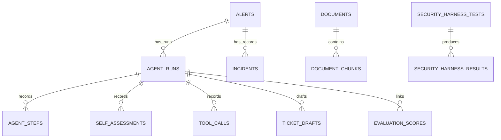

# Data Model

OpsGuard uses SQLModel and SQLAlchemy for relational persistence. PostgreSQL is the configured default; SQLite can be selected explicitly through `DATABASE_URL`. There is no automatic database failover.

The authoritative declarations are in [app/models](../backend/app/models). [app/db/session.py](../backend/app/db/session.py) creates the engine and request sessions; [app/db/init_db.py](../backend/app/db/init_db.py) creates missing tables with `SQLModel.metadata.create_all`. There is no schema-migration framework.

## Storage conventions

- Primary keys are UUIDs. Runtime rows generally use generated UUIDs; seeded records and ingested chunks have application-generated deterministic IDs.
- Structured fields use JSON, with a JSONB variant on PostgreSQL. Lists such as tags and citations are JSON values, not PostgreSQL array columns.
- Timestamp defaults use UTC. Timezone round-tripping depends on the database; SQLite may return naive timestamps.
- Status, severity, and trust columns remain strings, not database enums. Document/chunk trust assignments and API schemas validate the canonical `trusted`, `untrusted`, and `quarantined` labels; retrieval treats malformed legacy trust as quarantined.
- Foreign keys and indexes are declared in the models. There is no database uniqueness constraint for one run per alert, one assessment/ticket per run, or a document's title/source pair.

## Tables and current use

| Table / model | Principal fields and links | Current role |
| --- | --- | --- |
| `alerts` / `Alert` | Title, severity, source, infrastructure type, raw data, status, tags; nullable latest `agent_run_id` | Seeded incident inputs; runner updates investigation status and latest-run reference |
| `incidents` / `Incident` | `alert_id`, nullable `agent_run_id`, root cause, resolution, status | Seeded historical incident records queried by a local tool |
| `documents` / `Document` | Title, source type, source label in `file_path`, content hash, trust, version, tags, chunk count, scan result | Document metadata created by seeding or ingestion |
| `document_chunks` / `DocumentChunk` | `document_id`, index, content/hash, token estimate, trust, scan result, metadata | SQL content storage used directly by lexical retrieval |
| `agent_runs` / `AgentRun` | `alert_id`, status, provider/model label, counters, grounding heuristic, risk, approval state, timing, error | Investigation record created by runner and harness; also seeded |
| `agent_steps` / `AgentStep` | `agent_run_id`, index, node, status, input/output snapshots, duration, error | Persisted execution trace |
| `self_assessments` / `SelfAssessment` | `agent_run_id`, `step_id`, confidence, uncertainty, capability, known/missing evidence, decision, rationale | Deterministic assessment snapshots |
| `tool_calls` / `ToolCall` | `agent_run_id`, `step_id`, tool, arguments, output, trust, status, duration, scan result | Tool audit rows when a run context is supplied |
| `safety_events` / `SafetyEvent` | Optional run/harness-result links, event type, severity, component, details, pattern, resolution flag | Tool blocking, screening, watchdog, and harness findings |
| `ticket_drafts` / `TicketDraft` | `agent_run_id`, `alert_id`, title/body, actions, evidence links, team, SLA label, exported flag | Local draft records; no external export implementation |
| `security_harness_tests` / `SecurityHarnessTest` | Scenario identifier, category, payload, expected behavior, scoring metadata | Stored definitions maintained from fixtures and the Python scenario registry |
| `security_harness_results` / `SecurityHarnessResult` | `harness_run_id`, `test_id`, score/max score, passed flag, observed behavior, safety link, details | Persisted scenario outcomes |
| `evaluation_scores` / `EvaluationScore` | `agent_run_id`, metric fields, report type, overall score, `summary_payload` | Stored aggregate evaluation snapshots linked to an available run |
| `kill_chain_mappings` / `KillChainMapping` | `agent_run_id`, stages, indicators, confidences, rationale | Seeded records; the agent has no runtime kill-chain mapping node |
| `human_feedback` / `HumanFeedback` | `agent_run_id`, decision, reviewer label, reason, modified actions | Seeded records; no feedback or authenticated approval submission API |

The SQL column `document_chunks.metadata` maps to the Python attribute `chunk_metadata`. Chunks are not written to Qdrant.

## Relationships

The diagram shows principal foreign-key relationships, not enforced workflow cardinalities. An alert can have multiple runs; `alerts.agent_run_id` is a separate nullable back-reference updated by the runner. Harness runs are grouped by the `harness_run_id` value; there is no dedicated harness-run table.

Tool calls and assessments also reference a step. Safety events can reference a run and a harness result; harness results can reference a safety event. These relationships require deliberate deletion ordering.

## Status conventions

| Record | Values produced by the current runtime | Other stored conventions |
| --- | --- | --- |
| Agent run | `running`, `waiting_for_human`, `failed` | Seed data includes `completed` and `awaiting_approval` |
| Agent approval | Runner sets `pending` | Model default is `not_required`; seeded approval values are historical fixtures |
| Agent step | `running`, `completed`, `failed` | Harness and manual audit steps also use `completed` |
| Tool call | Registry writes `executed`, `blocked`, `failed` | Model default and seeded calls use `success` |
| Document/chunk scan | `pending`, `clean`, `flagged` | `quarantined` is handled as a trust label, not an automatic scan transition |
| Harness result | API exposes `passed`, `failed`, `partial` | Database stores a boolean `passed` plus score and detailed result payload |

A successful runner sets `completed_at` when it reaches `waiting_for_human`; this timestamp marks the end of computation, not a completed human review. Status fields do not implement an approval state machine.

## Persistence boundaries

Recommendations, hypotheses, and retrieved evidence are stored within step snapshots rather than separate normalized tables. New evidence snapshots retain run-scoped IDs, source/document/chunk/tool-call identity, trust, content or excerpt, and observation time. Hypotheses reference those evidence IDs, and tool citations include the specific `tool_calls` ID. These JSON references are validated by the workflow, not relational foreign keys. Confidence and grounding fields remain heuristics; valid evidence identity does not establish claim entailment.

Ingestion replaces chunks when document content changes; metadata-only updates synchronize trust and metadata on existing chunks without replacing their IDs. Effective retrieval trust resolves document, chunk, and legacy metadata labels restrictively. A document demotion immediately governs its existing chunks, even if an older chunk label is stale. Public ingestion cannot grant trusted authority or remove existing restrictions. Ordinary fixture upserts preserve demotions; an explicit reset recreates the fixed baseline.

Old trace evidence remains in snapshots, so an earlier chunk reference need not resolve to a currently stored chunk to display historical observations. Historical views never fill missing evidence through fresh retrieval. Legacy records are not retroactively assigned missing provenance. No SQL column migration is required for these snapshot and trust-validation changes; malformed pre-existing labels remain stored but are excluded by the retrieval boundary.

The runner and tool registry commit incrementally, so an investigation is not one atomic database transaction. Direct tool calls without run context lack tool-call rows. Audit records are ordinary mutable database records, with no tamper-evident log.

SQLite engine setup does not enable foreign-key enforcement explicitly; constraint behavior can therefore differ from PostgreSQL. Table creation does not migrate existing schemas. Use disposable databases for fixture reset and harness workflows, and review relationships before deleting retained records.

See [Agent Workflow](AGENT_GRAPH.md), [Retrieval and Evidence](RAG_DESIGN.md), [Tool Registry](TOOL_REGISTRY.md), and [API Reference](API_SPEC.md).
