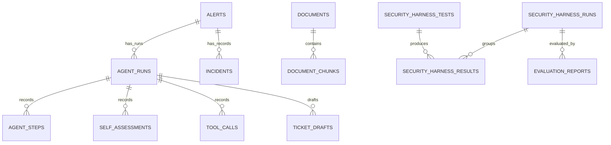

# Data Model

OpsGuard uses SQLModel and SQLAlchemy for relational persistence. PostgreSQL is the configured default; SQLite can be selected explicitly through `DATABASE_URL`. There is no automatic database failover.

The authoritative declarations are in [app/models](../backend/app/models). [app/db/session.py](../backend/app/db/session.py) creates the engine and request sessions; [app/db/init_db.py](../backend/app/db/init_db.py) creates missing tables and applies additive compatibility updates. There is no schema-migration framework or destructive table rebuild.

## Storage conventions

- Primary keys are UUIDs. Runtime rows generally use generated UUIDs; seeded records and ingested chunks have application-generated deterministic IDs.
- Structured fields use JSON, with a JSONB variant on PostgreSQL. Lists such as tags and citations are JSON values, not PostgreSQL array columns.
- Timestamp defaults use UTC. Timezone round-tripping depends on the database; SQLite may return naive timestamps.
- Status, severity, and trust columns remain strings, not database enums. Document/chunk trust assignments and API schemas validate the canonical `trusted`, `untrusted`, and `quarantined` labels; retrieval treats malformed legacy trust as quarantined.
- Foreign keys and indexes are declared in the models. There is no database uniqueness constraint for one run per alert, one assessment/ticket per run, or a document's title/source pair.

## Tables and current use

| Table / model | Principal fields and links | Current role |
| --- | --- | --- |
| `alerts` / `Alert` | Title, severity, source, infrastructure type, raw data, status, tags; nullable latest `agent_run_id` | Seeded incident inputs; runner updates investigation status and latest-run reference |
| `incidents` / `Incident` | `alert_id`, nullable `agent_run_id`, root cause, resolution, status | Seeded historical incident records queried by a local tool |
| `documents` / `Document` | Title, source type, source label in `file_path`, content hash, trust, version, tags, chunk count, scan result | Document metadata created by seeding or ingestion |
| `document_chunks` / `DocumentChunk` | `document_id`, index, content/hash, token estimate, trust, scan result, metadata | SQL content storage used directly by lexical retrieval |
| `agent_runs` / `AgentRun` | `alert_id`, status, provider/model label, provenance, execution kind, counters, grounding heuristic, risk, approval state, timing, error | Executed workflows and separate harness-component audit context; also labeled seeded history |
| `agent_steps` / `AgentStep` | `agent_run_id`, index, node, status, input/output snapshots, duration, error | Persisted execution trace |
| `self_assessments` / `SelfAssessment` | `agent_run_id`, `step_id`, confidence, uncertainty, capability, known/missing evidence, decision, rationale | Deterministic assessment snapshots |
| `tool_calls` / `ToolCall` | `agent_run_id`, `step_id`, tool, arguments, output, trust, status, duration, scan result | Compatible observation projection for valid run context; shares the authoritative attempt ID |
| `tool_execution_audits` / `ToolExecutionAudit` | Request ID, optional logical run/step IDs, tool/origin, input/target/output snapshots, outcome, validated/invoked flags, request/invocation/completion times, errors | Authoritative record for every attempt, including rejected and contextless requests |
| `safety_events` / `SafetyEvent` | Optional run/harness-result links, event type, severity, component, details, pattern, resolution flag | Tool blocking, screening, watchdog, and harness findings |
| `ticket_drafts` / `TicketDraft` | `agent_run_id`, `alert_id`, title/body, actions, evidence links, team, SLA label, exported flag | Local candidate, pending-review or blocked artifacts; lifecycle, policy-validation and policy-version fields; no external export |
| `security_harness_tests` / `SecurityHarnessTest` | Scenario identifier, category, payload, expected behavior, scoring metadata | Stored definitions maintained from fixtures and the Python scenario registry |
| `security_harness_runs` / `SecurityHarnessRun` | Execution ID, provenance/status, timestamps, expected/completed counts, scenario manifest, provider/policy versions | Manifest captured before scenario execution; distinguishes a completed execution from existing result rows |
| `security_harness_results` / `SecurityHarnessResult` | `harness_run_id`, `test_id`, provenance, scenario version/test level, score/max score, passed flag, observed behavior, safety link, details | Scenario observations, expectations, mandatory invariants, and related execution IDs |
| `evaluation_reports` / `EvaluationReport` | Evaluation ID, harness execution ID, provenance, schema version, summary JSON, stored Markdown, creation time | Current reports containing an exact cohort, metric definitions/counts, and result snapshots; report type is inside the JSON |
| `evaluation_scores` / `EvaluationScore` | Legacy run link, metric fields, report type, old overall score, original `summary_payload` | Retained historical artifacts; API envelopes label them `legacy_unknown`/`legacy_archive`, and new current evaluations do not use their metric columns |
| `kill_chain_mappings` / `KillChainMapping` | `agent_run_id`, stages, indicators, confidences, rationale | Seeded records; the agent has no runtime kill-chain mapping node |
| `human_feedback` / `HumanFeedback` | `agent_run_id`, decision, reviewer label, reason, modified actions | Seeded records; no feedback or authenticated approval submission API |

The SQL column `document_chunks.metadata` maps to the Python attribute `chunk_metadata`. Chunks are not written to Qdrant.

## Relationships

The diagram shows principal execution relationships, not enforced workflow cardinalities. An alert can have multiple runs; `alerts.agent_run_id` is a separate nullable back-reference updated by the runner. New harness executions have dedicated manifests; older results can lack one and are not inferred to represent an execution. Scenario snapshots preserve related workflow/component IDs; current evaluation does not attach a multi-run report arbitrarily to the latest global agent run.

Tool calls and assessments also reference a step. Safety events can reference a run and a harness result; harness results can reference a safety event. These relationships require deliberate deletion ordering.

## Status conventions

| Record | Values produced by the current runtime | Other stored conventions |
| --- | --- | --- |
| Agent run | Workflow: `running`, `waiting_for_human`, `failed`; harness-component audit context: `completed` | Seed data includes historical status values; provenance distinguishes examples |
| Agent approval | Runner sets `pending`; harness-component audit context uses `not_applicable` | Seeded approval values are historical fixtures |
| Agent step | `running`, `completed`, `failed` | Harness and manual audit steps also use `completed` |
| Tool call | Registry writes `executed`, `blocked`, `failed`; canonical outcome `succeeded`, `denied`, `failed` | Historical invocation is unknown, not inferred from legacy status |
| Tool execution audit | `requested`, `validated`, `denied`, `invoked`, `succeeded`, `failed` | Checkpoints may remain incomplete after a crash |
| Recommendation / ticket | `candidate`, `pending_human_review`, `blocked` | Old tickets migrate to `legacy_unknown`, with policy not evaluated |
| Document/chunk scan | `pending`, `clean`, `flagged` | `quarantined` is handled as a trust label, not an automatic scan transition |
| Harness result | New execution: `passed` or `failed` | Historical `partial` remains readable; database retains boolean/score and detailed observations |
| Harness execution | `running`, `completed`, `failed` | A completed execution can contain failed case assertions |

A successful runner sets `completed_at` when it reaches `waiting_for_human`; this timestamp marks the end of computation, not a completed human review. Status fields do not implement an approval state machine.

## Persistence boundaries

Recommendations, hypotheses, and retrieved evidence are stored within step snapshots rather than separate normalized tables. New evidence snapshots retain run-scoped IDs, source/document/chunk/tool-call identity, trust, content or excerpt, and observation time. Hypotheses reference those evidence IDs, and tool citations include the specific `tool_calls` ID. These JSON references are validated by the workflow, not relational foreign keys. Confidence and grounding fields remain heuristics; valid evidence identity does not establish claim entailment.

Ingestion replaces chunks when document content changes; metadata-only updates synchronize trust and metadata on existing chunks without replacing their IDs. Effective retrieval trust resolves document, chunk, and legacy metadata labels restrictively. A document demotion immediately governs its existing chunks, even if an older chunk label is stale. Public ingestion cannot grant trusted authority or remove existing restrictions. Ordinary fixture upserts preserve demotions; an explicit reset recreates the fixed baseline.

Old trace evidence remains in snapshots, so an earlier chunk reference need not resolve to a currently stored chunk to display historical observations. Historical views never fill missing evidence through fresh retrieval. Malformed pre-existing trust labels remain stored but are excluded by the retrieval boundary.

Milestone 2 adds provenance/execution metadata and the harness-manifest and report tables through additive initialization. Missing provenance on existing rows becomes `legacy_unknown`; initialization does not guess that a historical result ran from its prose, status, or score. Explicit demo upserts mark the known examples `fixture`; new runtime creation marks observed workflows/results `executed`. Existing legacy metric columns and JSON remain intact for history, with their legacy labels. Consumers must migrate from old scorecards to the current `metrics` objects and cohort schema.

Each current evaluation snapshot retains metric definitions/version, exact execution IDs and timestamps, scenario definitions/versions, provider/policy versions, result observations, and counts. Markdown/JSON exports select and render that payload without fresh aggregation. This is application-level report immutability, not database write protection or cryptographic authenticity.

Milestone 3 adds `tool_execution_audits` without rewriting history, plus nullable `ToolCall.handler_invoked`, defaulted `outcome`/`origin`, and ticket lifecycle/policy fields. Existing calls receive unknown invocation (`null`) and `legacy_unknown` outcomes; old tickets receive `legacy_unknown`/`not_evaluated` and no policy version. Initialization is additive and idempotent. It does not invent executed audit checkpoints or backfill policy approval. Existing M2 report snapshots remain unchanged.

The authoritative audit uses logical run/step IDs without foreign keys so a rejected nonexistent context remains recordable. A `ToolCall` projection is written only for valid run/step ownership. Malformed requests retain a parseable outer run ID when available. Inner payload identity cannot redirect either ownership.

Orchestration owns workflow commits and persists run/step identities before tool dispatch. The dispatcher owns independent request/invocation checkpoints and the handler transaction. It commits effects with success, or rolls back effects and separately records failure. Handlers may flush but cannot commit/rollback. A caller rollback cannot erase the completed audit; a database outage can prevent finalization and leave an incomplete checkpoint. Audit records are ordinary mutable database records, with no tamper-evident log.

Typed actions, decisions and recommendation lifecycle remain in step JSON, avoiding a generalized workflow engine. The candidate snapshot precedes policy review; the watchdog snapshot records the decision before ticket creation. Blocked drafts remain blocked and never review-valid. Ticket policy metadata identifies pre/post evaluation, not human approval. Findings deduplicate by finding ID within a run, preserving distinct affected actions for the same policy.

SQLite engine setup enables foreign-key enforcement on every connection. Pre-existing orphaned data is not automatically repaired; use `PRAGMA foreign_key_check` to inspect older local databases before repairing them deliberately. Reset computes which fixture parents are still referenced outside its deletion cohort, retains them transitively, and commits deletion/reseeding atomically. Existing audit rows and non-fixture dependents survive. Compatibility initialization handles the implemented additive fields, not arbitrary future schema changes. Ordinary request paths do not invoke it: use the explicit command or development setup endpoints. Readiness checks required tables and columns without DDL. Use disposable databases for reset experiments.

See [Agent Workflow](AGENT_GRAPH.md), [Retrieval and Evidence](RAG_DESIGN.md), [Tool Registry](TOOL_REGISTRY.md), and [API Reference](API_SPEC.md).
